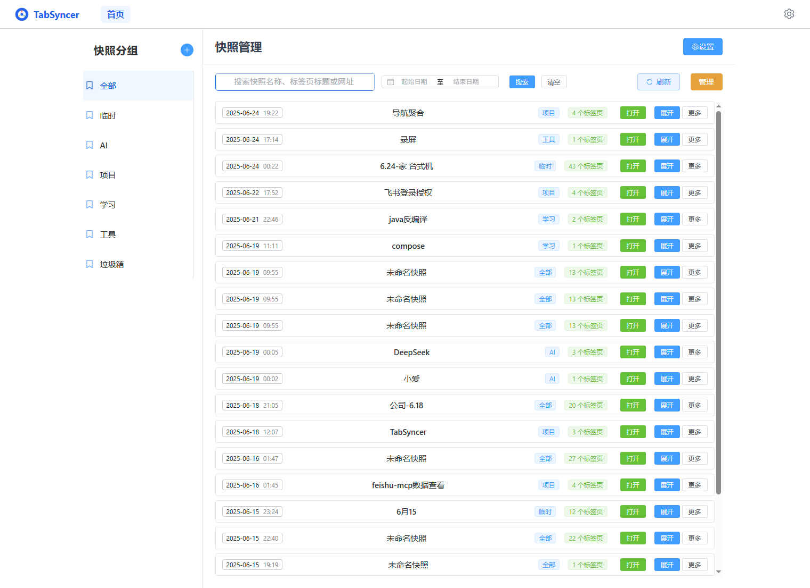

# TabSyncer

[View in Chinese](README.md) | [View in English](README.en.md)

TabSyncer is a Chrome extension that helps users save snapshots of all open tabs with one click, supporting multi-device account login, snapshot synchronization, and management. It's perfect for users who frequently switch between multiple computers and need to batch manage and restore their browser workspace.

---

## Key Features
- **One-Click Snapshot**: Save all tabs in the current window with cloud synchronization.
- **Snapshot Group Management**: Customize groups to categorize different types of snapshots.
- **Multi-Device Sync**: Support account login for syncing snapshots across multiple devices.
- **Batch Tab Recovery**: Open all tabs from a snapshot with one click.
- **Snapshot Management**: Rename, delete, group, merge, add, and batch operations for flexible snapshot management.
- **Recycle Bin Group**: Deleted snapshots go to the recycle bin, with batch or individual recovery options.
- **Recovery Features**: Support batch and individual snapshot recovery, with snapshots returning to their original groups.
- **Multi-language Support**: All operations, popups, and buttons support multiple languages with complete i18n configuration.
- **Management Mode**: Support batch selection, batch delete/recover/merge, with selected snapshots displayed at the top.
- **Group Sidebar**: Recycle bin group has no more buttons, while regular groups can be renamed/deleted.
- **Snapshot Item Behavior**: Snapshots in recycle bin cannot be renamed/grouped, with more menu only showing recovery option.

---

## Usage Guide
1. **Account Login**: First-time users need to log in via email verification code.
2. **Save Snapshot**: Click the extension icon or right-click menu "Save Snapshot": Supports saving current tab, current window tabs, all window tabs, or saving all windows separately.
3. **Manage Snapshots**: On the main page, you can group, rename, delete, merge, recover, and perform batch operations on snapshots.
4. **Recycle Bin Group**: Deleted snapshots can be recovered in batch or individually from the recycle bin group.
5. **Multi-Device Sync**: Log in with the same account on any device to automatically sync snapshots.
6. **Non-Extension Management**: Visit [https://www.joker.blue/tab/main](https://www.joker.blue/tab/main) to manage the extension, avoiding plugin installation on temporary computers.

---

## Screenshots

---

## Contact & Feedback
For questions or suggestions, feel free to create an issue or PR.

---

## Version Information
Check out the [Version Introduction](VERSION.md) for detailed features and updates.

