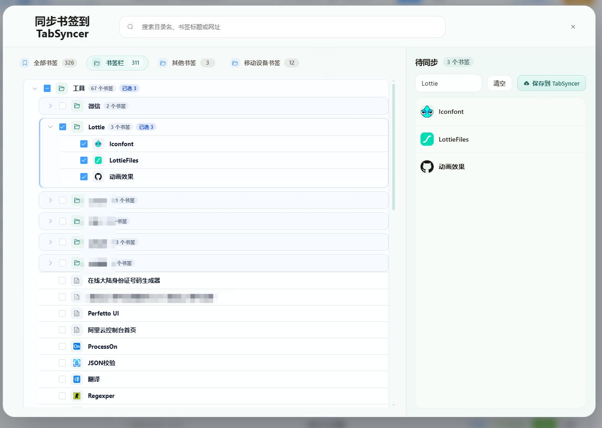
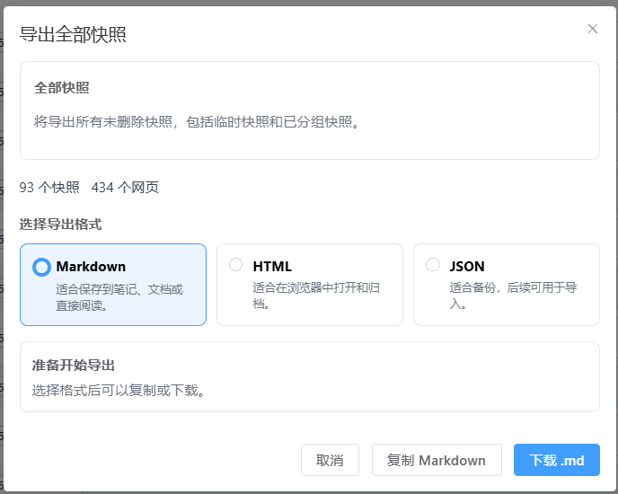

# TabSyncer

[查看中文版](README.md) | [View in English](doc/README.en.md)

TabSyncer 是一套围绕浏览器工作现场的 Chrome 扩展工具。它不只是把标签页保存成快照，而是把「打开浏览器后的入口」「当前已打开 Tab 的整理」「历史快照的分组沉淀」「快照之间的关联图谱」串成一个完整闭环。

核心使用路径是：在 NewTab 进入工作区，用 Tabout 整理当前已经打开的 Tab，把值得保留的上下文保存为快照，再到首页用快照列表、分组和关联图谱持续管理这些工作资料。

---

## 核心闭环

在这个闭环之外，TabSyncer 也支持把 Chrome 里已经积累的书签导入进来，并在整理沉淀完成后把快照导出到本地，让工作资料真正形成「导入 -> 整理 -> 沉淀 -> 导出」的完整路径。

### 1. 导入 Chrome 书签：把已有资料带入工作区

如果你在 Chrome 里已经积累了大量书签，也可以直接导入到 TabSyncer，作为后续整理、补充和沉淀的起点，而不需要从零开始重新收集。

### 2. NewTab：每天打开浏览器后的工作入口

TabSyncer 可以接管 Chrome 新标签页，把它变成一个轻量工作台：

- 固定常用网址快捷入口
- 固定常用快照快捷入口
- 从快照快捷入口直接预览并打开其中的标签页
- 展示上次未完成的整理草稿
- 推荐最近可能要继续使用的快照
- 从当前窗口 Tab 状态快速进入整理流程

### 3. Tabout：管理当前已经打开的 Tab

NewTab 中的整理能力面向「现在已经打开的一堆 Tab」：

- 查看当前窗口和其他窗口中已打开的标签页
- 按窗口、分组、相似域名和重复页面整理 Tab
- 选择要保留的 Tab，关闭不需要的 Tab
- 将整理后的标签页保存为新的快照
- 继续上一次未完成的整理草稿

这部分解决的是浏览器越用越乱之后，如何把当前工作现场重新收拢起来。

### 4. 首页：快照列表、分组展示与长期管理

首页是快照沉淀后的管理中心：

- 按全部、临时、分组、垃圾箱查看快照
- 支持快照分组展示和分组管理
- 支持搜索快照名称、Tab 标题、URL 和日期范围
- 支持重命名、删除、恢复、合并、批量操作
- 支持向已有快照继续添加网页
- 支持把快照或快照内单个网页加入 NewTab 快捷入口

这部分解决的是保存之后如何查找、归档、合并和继续维护。

### 5. 关联图谱：从关系视角理解快照

除了列表视图，TabSyncer 也提供快照关联图谱：

- 以图谱方式展示快照之间的关系
- 结合标签、标题、URL 等信息辅助发现相关快照
- 适合回看项目资料、研究资料和长期积累的上下文

这部分让快照不只是线性列表，而是可以通过关系重新被发现。

### 6. 导出快照到本地：把沉淀结果带走

整理和沉淀后的快照不仅可以继续留在 TabSyncer 中使用，也可以按需导出到本地，方便备份、迁移或离线保存，让这套工作流真正闭环。

---

## 主要功能

- **一键保存快照**：支持保存当前标签页、当前窗口、所有窗口，或按窗口拆分保存。
- **NewTab 工作区**：搜索、快捷入口、快照入口、工作连续性提示集中在新标签页。
- **Tabout 当前 Tab 管理**：整理已打开标签页，处理重复页和分组，并将结果保存为快照。
- **导入 Chrome 书签**：把已有 Chrome 书签快速导入到 TabSyncer，直接转成可继续整理和沉淀的工作资料。
- **快照列表与分组**：按视图和分组管理快照，支持长期归档。
- **快照关联图谱**：从关系视角查看历史快照。
- **快照内补充网页**：把当前已打开 Tab 或手动输入的网址添加到已有快照。
- **导出快照到本地**：支持将快照内容导出到本地，方便备份、迁移和离线留存。
- **多设备同步**：登录同一账号后，快照可在多台设备之间同步。
- **快捷入口维护**：把 URL、快照、快照内网页加入新标签页入口。
- **垃圾箱恢复**：误删的快照会进入垃圾箱，支持单个或批量恢复。
- **多语言界面**：内置多语言文案，覆盖主要操作与界面提示。

### 导入 Chrome 书签

可以先把 Chrome 里已经积累的书签导入进来，作为快照继续整理、补充和长期管理，让已有资料自然进入 TabSyncer 的工作流。

### 导出快照到本地

沉淀下来的快照不仅可以在 TabSyncer 内继续使用，也可以导出到本地保存，真正形成从导入、整理、沉淀到导出的完整闭环。

---

## 使用场景

### 多设备办公

在办公室保存一组工作标签页，回到家后登录同一账号即可恢复，不用重新逐个查找。

### 当前浏览器太乱

打开 NewTab 的 Tabout 整理当前已打开的标签页，关闭重复页，把值得保留的内容沉淀成快照。

### 项目资料沉淀

把文档、控制台、测试环境、代码仓库、设计稿保存为项目快照，后续继续补充和整理。

### 回看历史上下文

在首页按分组查找快照，或进入关联图谱，从关系视角找回过去保存的资料。

---

## 安装方式

### 方式一：Chrome Web Store 直接安装

推荐直接从 Chrome Web Store 添加：

[TabSyncer - Chrome Web Store](https://chromewebstore.google.com/detail/tabsyncer/ngfhokcebemclkfagnkgfficddkmcoim)

### 方式二：安装发布包

1. 打开仓库发布页或直接下载仓库中的 `TabSyncer.zip`
2. 解压 `TabSyncer.zip`
3. 在 Chrome 中打开 `chrome://extensions/`
4. 打开“开发者模式”
5. 选择“加载已解压的扩展程序”
6. 选择解压后的扩展目录

### 方式三：访问 Web 管理端

如果只是临时查看或管理快照，也可以直接访问：

[https://www.joker.blue/tab/main](https://www.joker.blue/tab/main)

---

## 使用流程

1. **登录账号**：首次使用需要登录账号，当前版本支持邮箱验证码登录，也支持 GitHub 登录。
2. **导入已有资料**：可先将 Chrome 书签导入 TabSyncer，快速把过去积累的网址带入当前工作区。
3. **配置 NewTab**：启用 TabSyncer 新标签页，把常用 URL 或快照加入快捷入口。
4. **整理当前 Tab**：从 NewTab 进入 Tabout，整理当前已打开的标签页。
5. **保存快照**：把当前窗口、全部窗口或整理后的 Tab 保存为快照。
6. **管理快照**：在首页用列表、分组、搜索、合并、恢复等能力维护快照。
7. **查看关联图谱**：通过图谱理解快照之间的关系，找回相关上下文。
8. **导出到本地**：将整理和沉淀后的快照导出到本地，方便备份、迁移或离线保存。
9. **继续工作**：从 NewTab 快捷入口或首页恢复快照，回到之前的工作现场。

---

## 反馈

如有问题、建议或使用反馈，欢迎提交 issue 或 PR。

---

## 版本说明

历史版本说明可见 [doc/VERSION.zh.md](doc/VERSION.zh.md)。

---

## 加入交流群

欢迎加入 TabSyncer QQ 交流群，一起交流使用体验、反馈问题和功能建议。群内也会提前同步 beta 版本体验信息，适合愿意一起打磨浏览器工作流的朋友。

