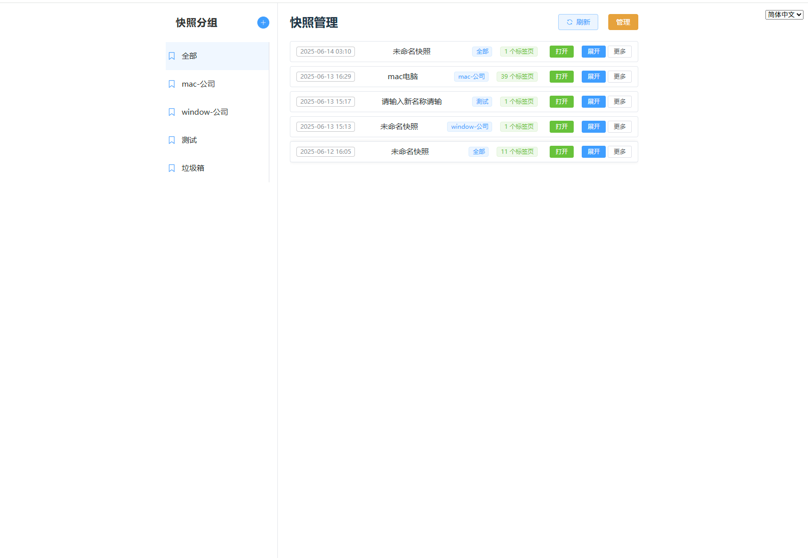

# TabSyncer

[View in Chinese](../README.md) | [View in English](README.en.md)

TabSyncer is a Chrome extension that helps users save snapshots of all open tabs with one click, supporting multi-device account login, snapshot synchronization, and management. It's perfect for users who frequently switch between multiple computers and need to batch manage and restore their browser workspace.

---

## Key Features
- **One-Click Snapshot**: Save all tabs in the current window with cloud synchronization.
- **Snapshot Group Management**: Customize groups to categorize different types of snapshots.
- **Multi-Device Sync**: Support account login for syncing snapshots across multiple devices.
- **Batch Tab Recovery**: Open all tabs from a snapshot with one click.
- **Snapshot Management**: Rename, delete, group, merge, add, and batch operations for flexible snapshot management.
- **Recycle Bin Group**: Deleted snapshots go to the recycle bin, with batch or individual recovery options.
- **Recovery Features**: Support batch and individual snapshot recovery, with snapshots returning to their original groups.
- **Multi-language Support**: All operations, popups, and buttons support multiple languages with complete i18n configuration.
- **Management Mode**: Support batch selection, batch delete/recover/merge, with selected snapshots displayed at the top.
- **Group Sidebar**: Recycle bin group has no more buttons, while regular groups can be renamed/deleted.
- **Snapshot Item Behavior**: Snapshots in recycle bin cannot be renamed/grouped, with more menu only showing recovery option.

---

## Use Cases

### Case 1: Multi-device Work
When switching between office and home work environments, there's no need to manually record and reopen tabs. After saving your workspace at the office, you can restore all tabs with one click at home and continue working seamlessly.

### Case 2: Project Archiving
During project development, you often need to save reference materials for different stages. Use TabSyncer to create independent snapshots for each project and add project names for easy future reference and recovery.

### Case 3: Temporary Storage
When browsing design inspiration or collecting materials, you might need to close the browser suddenly. Use TabSyncer to save all current tabs, and restore them with one click next time without losing any important information.

### Case 4: Material Integration
When collecting materials, you might save different snapshots multiple times. Use the merge feature to combine multiple snapshots into a complete collection for unified management and use.

---

## Installation Guide

1. Visit GitHub repository: https://github.com/cso1z/TabSyncerForPublic
2. Download the latest release version
3. Extract the TabSyncer.zip file
4. Open Chrome browser's extension page ([chrome://extensions/](chrome://extensions/))
5. Enable developer mode
6. Drag and drop the downloaded plugin file into the browser to install
7. Register an account and log in
8. Start using

---

## Screenshots

---

## Contact & Feedback
For questions or suggestions, feel free to create an issue or PR.

---

## Version Information
Check out the [Version Introduction](VERSION.md) for detailed features and updates.

