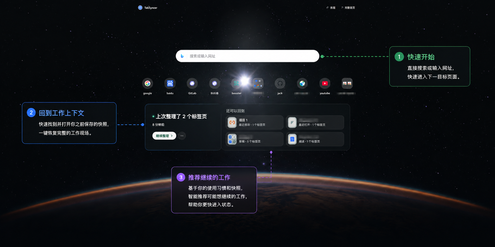
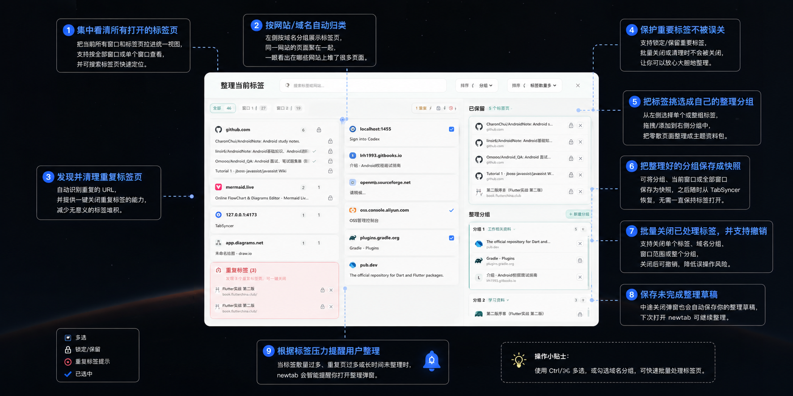
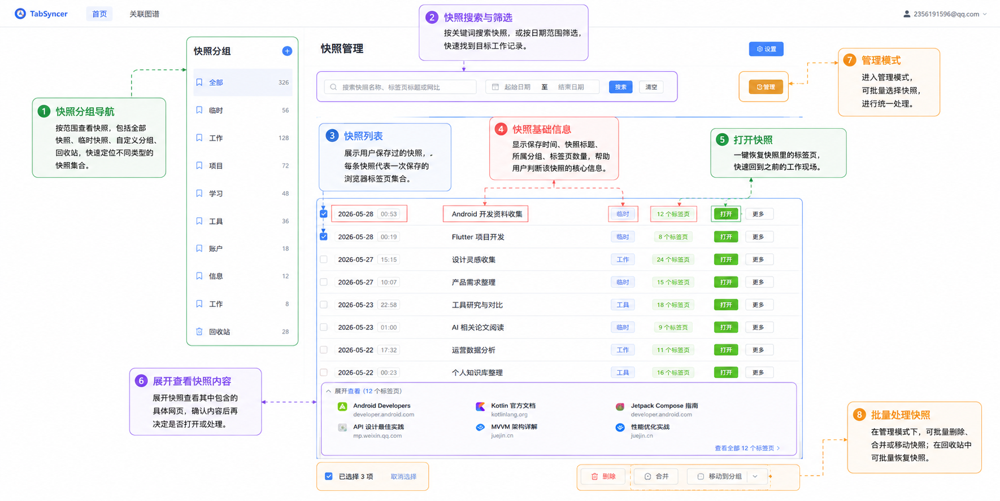
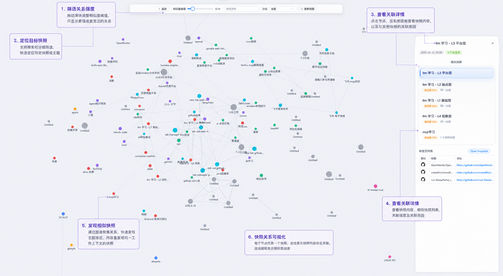
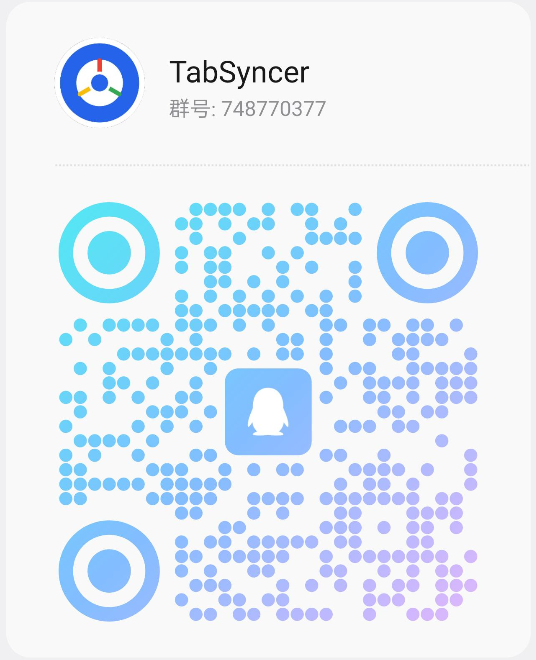

# TabSyncer

[View in Chinese](../README.md) | [View in English](README.en.md)

TabSyncer is a Chrome extension suite for managing browser workspaces. It is not only a snapshot saver. Its core loop connects the new tab entry point, Tabout for organizing currently open tabs, saved snapshot maintenance, and continuing work across devices.

The main flow is: start from NewTab, organize currently open tabs with Tabout, save valuable context as snapshots, then manage those snapshots from the home page through lists, groups, and search.

---

## Core Capabilities

1. **Use NewTab As The Daily Work Entry**

   Keep frequent links, snapshot entries, and work-continuity prompts on the new tab page. TabSyncer supports arbitrary saved links, making the browser's daily work entry more focused.

2. **Organize Currently Open Tabs**

   Use Tabout to review, filter, and organize open tabs, handle duplicates, similar domains, and groups, then save the cleaned-up result.

3. **Save Browser Workspaces**

   Save the current tab, current window, all windows, or split windows into separate snapshots, turning temporary browser sessions into contexts you can return to later.

4. **Manage And Maintain Snapshots**

   Group, search, restore, and enrich snapshots with additional pages so they become maintainable project contexts instead of one-time archives.

5. **Continue Work Across Devices**

   After signing in with the same account, snapshots and work contexts can sync across office desktops, home computers, laptops, and other devices.

## Product Workflow

### 1. Start From NewTab

TabSyncer can turn Chrome's new tab page into a lightweight workspace that brings frequent links, snapshot entries, work-continuity prompts, and the open-tab organizer together. Frequent websites and work entry points can also be saved as clearer shortcuts.

### 2. Organize Open Tabs With Tabout

When the browser becomes noisy, open Tabout from NewTab to review tabs across the current window and other windows, organize them by window, group, similar domain, and duplicate page, then decide what should be kept.

### 3. Save And Manage Snapshots

Organized tabs can be saved as snapshots. After saving, use the home page to view all, temporary, grouped, and deleted snapshots, search them, rename them, merge them, restore them, or add more pages to an existing context.

## Supporting Capabilities

- **Import Chrome bookmarks**: Bring existing materials into TabSyncer as a starting point for organization.
- **Export snapshots to local files**: Back up, migrate, or keep snapshots offline.
- **Relationship graph**: Rediscover related snapshots and contexts from a graph-based view.
- **Enhanced shortcuts**: Configure clearer entries and icons for frequent websites and work entry points.
- **Recycle bin recovery**: Restore deleted snapshots individually or in batches.
- **Multi-language UI**: Cover core actions, dialogs, and interface prompts with built-in localized copy.

Relationship graph example:

---

## Use Cases

1. **Continue Work Across Devices**

   Save a set of work tabs at the office, sign in at home, and restore the same context without hunting every page down again.

2. **Preserve Project Contexts**

   Save docs, dashboards, repositories, test environments, and design references as project snapshots that can keep growing over time.

3. **Start Each Day From NewTab**

   Put frequent websites, project snapshots, and work entries you want to continue on NewTab so you can return to work faster after opening the browser.

4. **Clean Up A Noisy Browser**

   Open Tabout from NewTab, organize currently open tabs, close duplicates, and save the important context as a snapshot.

5. **Rediscover Past Context**

   Use grouped snapshot lists on the home page, or open the graph view to find related historical material.

---

## Installation

### Option 1: Install From Chrome Web Store

The recommended way is to install TabSyncer directly from Chrome Web Store:

[TabSyncer - Chrome Web Store](https://chromewebstore.google.com/detail/tabsyncer/ngfhokcebemclkfagnkgfficddkmcoim)

### Option 2: Install The Release Package

1. Download `TabSyncer.zip` from this repository or the latest release.
2. Extract `TabSyncer.zip`.
3. Open `chrome://extensions/` in Chrome.
4. Enable Developer mode.
5. Click "Load unpacked".
6. Select the extracted extension directory.

### Option 3: Use The Web Manager

For temporary snapshot viewing or management, you can also open:

[https://www.joker.blue/tab/main](https://www.joker.blue/tab/main)

---

## Feedback

Questions, ideas, and pull requests are welcome.

---

## Version Notes

Historical version notes are available in [VERSION.md](VERSION.md).

---

## Join The Community

Join the TabSyncer QQ group to discuss usage tips, share feedback, suggest features, and get early access notes for beta builds. It is a good place for users who want to help shape the browser workspace workflow.

